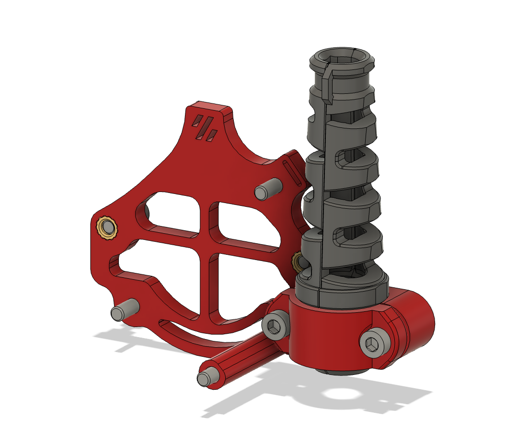

# WWG2 NH36/EBB36 mount for PUG

I find [PUG](https://www.printables.com/model/378567-pug-parametric-umbilical-gland) to be far superior to PG7 mounts, so made this guy.

Additionally, the NH36 connector sticks up really high, so this also lowers the cable a bit. 

This is based off [tetsu and Thor's existing canboard mounts](https://github.com/tetsu97/WristWatch-G2-Extruder/blob/main/CAD/WWG2_canboard_mounts.step)

To be used with [WristWatch G2](https://github.com/tetsu97/WristWatch-G2-Extruder/tree/main)

## BOM

| **Item**                     | **Qty**    |
| ---------------------------- | ---------- |
| **M3x5x4 Heatset Insert**    | **4**      |
| **M3x8 SHCS**                | **6**      | 
| **M3x35 SHCS**               | **1**      | 
| **20mm standoffs**           | **2**      | 

## Printing

Parts should be oriented correctly in the STLs. Standard Voron settings

The 3mm spacers are meant to be threaded into to act as captive screws

## Glamour Shots

