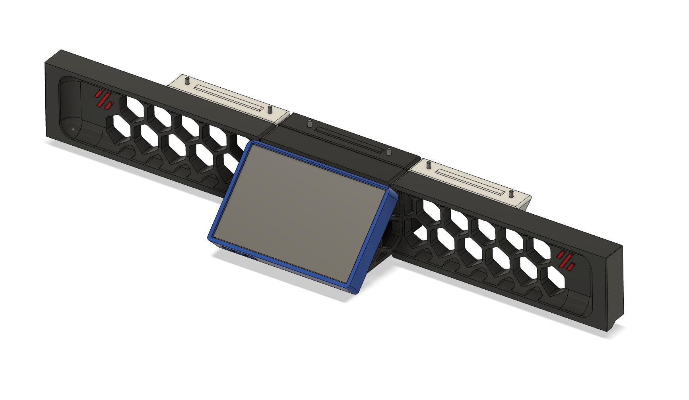
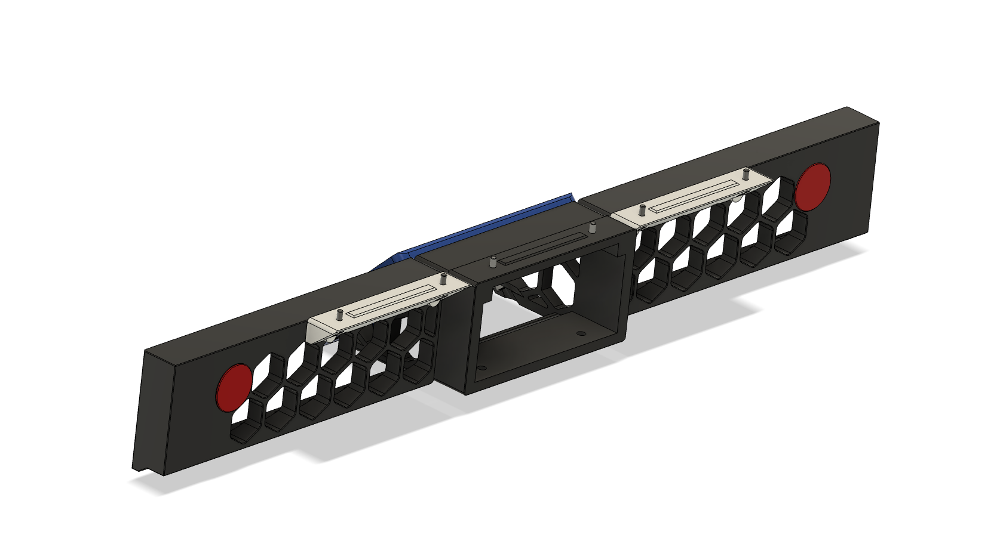

# Thicc skirts for Voron V2 and Trident
Extended skirts to look nicer and make the screen more readable with the [awesome Clicky Clack door mod](https://github.com/tanaes/whopping_Voron_mods/tree/main/clickyclacky_door), while not replacing any important bits (like z belt drives).

There are versions for
- [250mm](https://github.com/therick0996/voron_mods/tree/main/thicc_skirts/250mm)
- [300mm](https://github.com/therick0996/voron_mods/tree/main/thicc_skirts/300mm)
- [350mm](https://github.com/therick0996/voron_mods/tree/main/thicc_skirts/350mm)

To save material and not require supports, the new skirts attach to small "brackets", which are attached to the original extrusion.

## BOM

| **Item**                     | **Qty**    |
| ---------------------------- | ---------- |
| **M3x5x4 Heatset Insert**    | **8**      |
| **M3x8 SHCS**                | **14**     | 

## Printing

Parts should be oriented correctly in the STLs. No need for standard Voron settings, as these are non-functional parts. I used 5 top and bottom layers, 4 walls, 15% infill

## Glamour Shots

