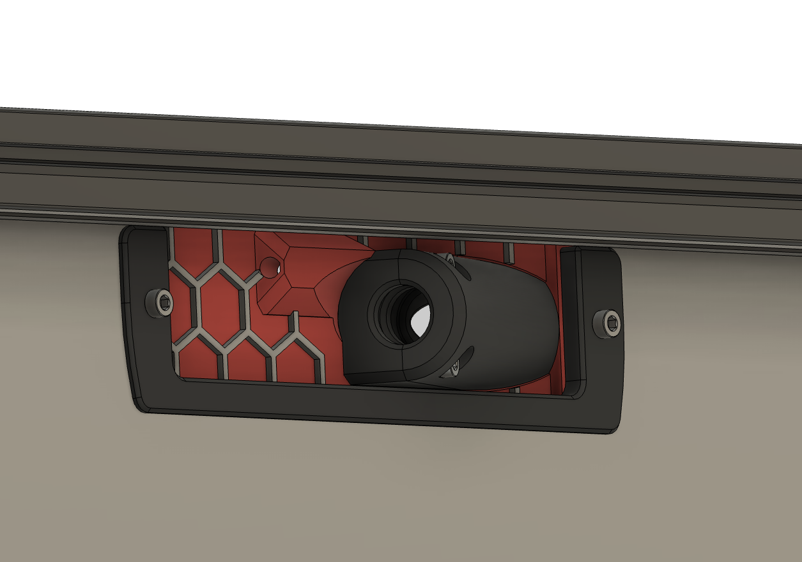
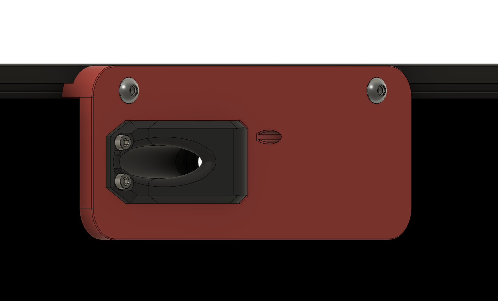
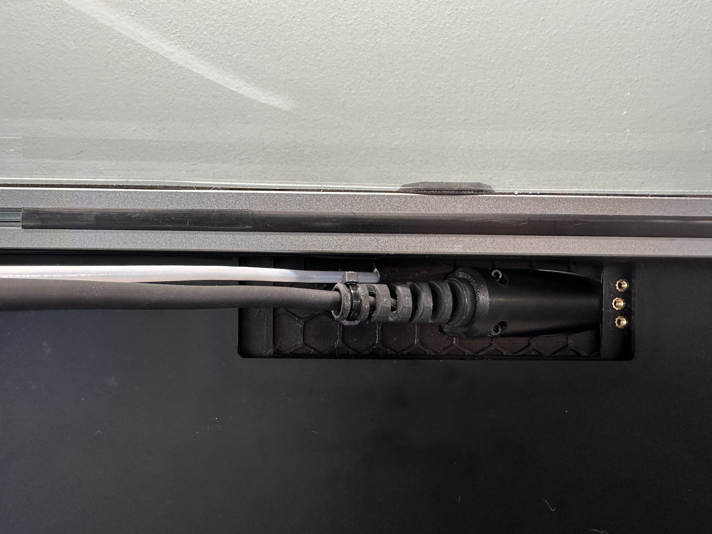
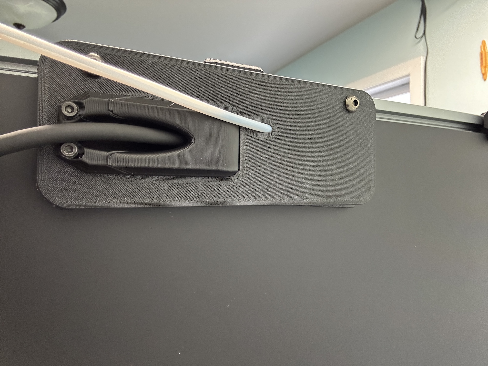

# Umbilical Rear Passthrough for PUG

I find [PUG](https://www.printables.com/model/378567-pug-parametric-umbilical-gland) to be far superior to PG7 mounts

This is based off [whopping's PG7 passthrough](https://github.com/tanaes/whopping_Voron_mods/tree/main/umbilical_passthrough), which in turn is based off the [Back plate blanking plate ](https://github.com/VoronDesign/VoronUsers/tree/main/printer_mods/richardjm/back-plate) by the legendary Richardjm

### To do
add images of how to assemble

## BOM

| **Item**                     | **Qty**    |
| ---------------------------- | ---------- |
| **M3x5x4 Heatset Insert**    | **6**      |
| **M3x8 SHCS**                | **2**      | 
| **M3x10 SHCS**               | **4**      | 
| **M5x20 BHCS**               | **2**      | 
| **M5 T-Nuts**                  | **2**      |
| **3mm Foam Tape**            | **approx 300mm** | 

## Printing

Parts should be oriented correctly in the STLs. Standard Voron settings

## Glamour Shots

